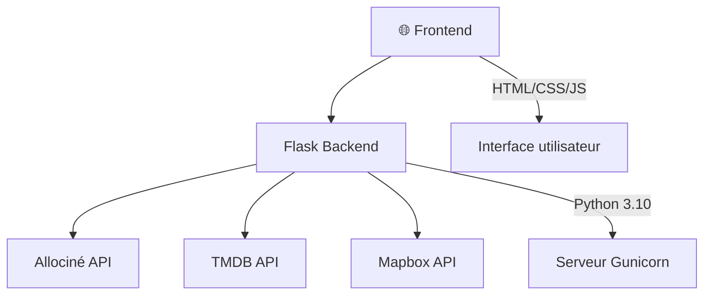

<div align="center">

# 🎬 CinéLyon

<i>Découvrez la scène cinématographique de Lyon instantanément et sans effort</i>

<br/>

<!-- Badges de statut -->
[](LICENSE)
[](https://github.com/votre-username/cinelyon/graphs/commit-activity)
[](https://github.com/votre-username/cinelyon)

<!-- Badges techniques -->
<p>
  <a href="https://www.python.org/">
    
  </a>
  <a href="https://flask.palletsprojects.com/">
    
  </a>
  <a href="https://gunicorn.org/">
    
  </a>
</p>

<!-- Badges Frontend -->
<p>
  <a href="https://html.spec.whatwg.org/">
    
  </a>
  <a href="https://www.w3.org/Style/CSS/">
    
  </a>
  <a href="https://developer.mozilla.org/en-US/docs/Web/JavaScript">
    
  </a>
</p>

<!-- Badges APIs -->
<p>
  <a href="https://www.allocine.fr/">
    
  </a>
  <a href="https://www.themoviedb.org/">
    
  </a>
  <a href="https://www.mapbox.com/">
    
  </a>
</p>

<br/>


</div>

<br/>

## 📋 Table des matières

- [✨ Fonctionnalités](#-fonctionnalités)
- [🎬 Cinémas supportés](#-cinémas-supportés)
- [🚀 Installation](#-installation)
- [🏗️ Architecture](#️-architecture)
- [⚙️ Configuration avancée](#️-configuration-avancée)
- [🌐 Déploiement](#-déploiement)
- [🤝 Contribution](#-contribution)
- [⚠️ Problèmes connus](#️-problèmes-connus)
- [📝 Crédit](#-crédit)

---

## ✨ Fonctionnalités

<table>
  <tr>
    <td>📅 <b>Calendrier interactif</b></td>
    <td>Visualisez les horaires sur 7 jours</td>
  </tr>
  <tr>
    <td>📖 <b>Informations détaillées</b></td>
    <td>Synopsis, réalisateur, genres, durée, notes</td>
  </tr>
  <tr>
    <td>🗺️ <b>Carte interactive</b></td>
    <td>Localisation de tous les cinémas de Lyon avec Mapbox</td>
  </tr>
  <tr>
    <td>🎨 <b>Interface moderne</b></td>
    <td>Design responsive et élégant</td>
  </tr>
  <tr>
    <td>🔄 <b>Données en temps réel</b></td>
    <td>Horaires mis à jour depuis Allociné</td>
  </tr>
  <tr>
    <td>⭐ <b>Notes et critiques</b></td>
    <td>Intégration avec TMDB pour les évaluations</td>
  </tr>
</table>

---

## 🎬 Cinémas supportés

| Cinéma | Type |
|--------|------|
| 🎥 Pathé Carré de Soie | Multiplex |
| 🎥 Pathé Bellecour | Multiplex |
| 🎥 UGC Part-Dieu | Multiplex |
| 🎥 UGC Confluence | Multiplex |
| 🎥 UGC Internationale | Multiplex |
| 🎬 Ciné Meyzieu | Indépendant |
| 🎬 Ciné Toboggan | Indépendant |

---

## 🚀 Installation

### Prérequis

| Outil | Version | Description |
|-------|---------|-------------|
| Python | 3.10+ | Langage principal |
| pip | dernière | Gestionnaire de paquets |
| TMDB API | - | Pour les métadonnées des films |
| Mapbox API | - | Pour la carte interactive |

### Installation rapide

```bash
# 1. Cloner le repository
git clone https://github.com/votre-username/cinelyon.git
cd cinelyon

# 2. Installer les dépendances
pip install -r requirements.txt

# 3. Configurer les variables d'environnement
cp .env.example .env  # puis éditer le fichier .env

# 4. Lancer l'application
python app.py
```

> 💡 L'application sera accessible sur `http://localhost:5000`

### Configuration du fichier `.env`

```env
# Clé API TMDB (obligatoire)
TMDB_API_KEY=votre_clé_tmdb_ici

# Clé API Mapbox (pour afficher la carte)
MAPBOX_TOKEN=votre_clé_mapbox_ici

# Liste des cinémas (JSON)
THEATERS=[{"id":"P8507","name":"Pathé Carré de Soie","latitude":45.7641958,"longitude":4.9212527}]
```

### Obtenir les clés API

| Service | Lien | Description |
|---------|------|-------------|
| 🎬 TMDB | [themoviedb.org](https://www.themoviedb.org/settings/api) | Métadonnées des films |
| 🗺️ Mapbox | [mapbox.com](https://console.mapbox.com/account/access-tokens/) | Carte interactive |

---

## 🏗️ Architecture

### Structure du projet

```
cinelyon/
├── 📄 app.py                 # Application Flask principale
├── 📄 requirements.txt       # Dépendances Python
├── 📄 .env                   # Variables d'environnement
├── 📁 modules/
│   └── 📄 Classes.py         # Classes métier (Movie, Theater, Showtime)
├── 📁 templates/
│   ├── 📄 base.html          # Template de base
│   └── 📄 index.html         # Page principale
└── 📁 static/
    ├── 📁 css/
    │   └── 📄 main.css       # Styles CSS
    ├── 📁 font/              # Polices personnalisées
    └── 📁 images/            # Images et icônes
```

### Stack technique



---

## ⚙️ Configuration avancée

### Ajouter de nouveaux cinémas

> ⚠️ Plus il y a de cinémas, plus le temps de chargement sera long

Modifiez la variable `THEATERS` dans votre fichier `.env` :

```json
[
  {"id":"P8507","name":"Pathé Carré de Soie","latitude":45.7641958,"longitude":4.9212527},
  {"id":"NOUVEAU_ID","name":"Nouveau Cinéma","latitude":XX.XXXXX,"longitude":X.XXXXX}
]
```

#### Trouver l'ID d'un cinéma

Consultez l'URL Allociné du cinéma :
- **URL** : `https://www.allocine.fr/seance/salle_gen_csalle=P8507.html`
- **ID** : `P8507`

### Personnalisation

| Élément | Fichier | Description |
|---------|---------|-------------|
| Titre du site | `app.py` | Modifier `WEBSITE_TITLE` |
| Styles | `static/css/main.css` | Design de l'interface |
| Couleurs | `static/css/main.css` | Variables CSS |

---

## 🌐 Déploiement

### Heroku

1. **Créez un `Procfile`** :
   ```
   web: gunicorn app:app
   ```

2. **Déployez** :
   ```bash
   git add .
   git commit -m "Deploy to Heroku"
   git push heroku main
   ```

### Docker

```dockerfile
FROM python:3.10-slim

WORKDIR /app
COPY requirements.txt .
RUN pip install --no-cache-dir -r requirements.txt

COPY . .
EXPOSE 5000

CMD ["gunicorn", "--bind", "0.0.0.0:5000", "app:app"]
```

```bash
# Build et run
docker build -t cinelyon .
docker run -p 5000:5000 cinelyon
```

---

## 🤝 Contribution

Les contributions sont les bienvenues ! 🎉

```bash
# 1. Fork le projet
# 2. Créer une branche
git checkout -b feature/AmazingFeature

# 3. Commiter vos changements
git commit -m 'Add some AmazingFeature'

# 4. Pousser vers la branche
git push origin feature/AmazingFeature

# 5. Ouvrir une Pull Request
```

---

## ⚠️ Problèmes connus

| Problème | Description |
|----------|-------------|
| 🔄 Données Allociné | Peuvent être temporairement indisponibles |
| 📖 Synopsis manquants | Certains films non trouvés sur TMDB |
| 📅 Dates de sortie | Parfois incorrectes ou inexistantes |

---

## 📝 Crédit

> Ce projet est un fork de [grainParisArt-Public](https://github.com/solene-drnx/grainParisArt-Public).

---

<div align="center">

**🎬 CinéLyon** — *Parce que le cinéma lyonnais mérite plus d'attention !*

<br/>

[](https://github.com/votre-username/cinelyon)
[](https://github.com/votre-username/cinelyon/fork)

</div>
