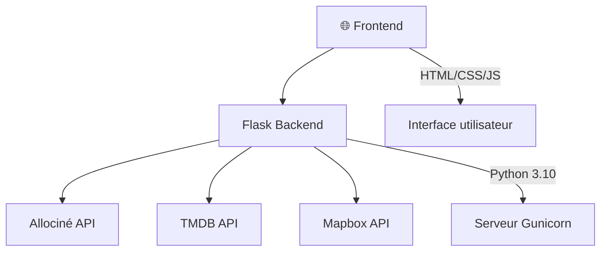

<div align="center">

# CinéLyon
<i>Découvrez la scène cinématographique de Lyon instantanément et sans effort</i>

<p align="center">
  <a href="https://www.python.org/">
    
  </a>
  <a href="https://html.spec.whatwg.org/">
    
  </a>
  <a href="https://www.w3.org/Style/CSS/">
    
  </a>
  <a href="https://developer.mozilla.org/en-US/docs/Web/JavaScript">
    
  </a>
  <a href="https://flask.palletsprojects.com/">
    
  </a>
  <a href="https://gunicorn.org/">
    
  </a>
  <a href="https://www.themoviedb.org/">
    
  </a>
  <a href="https://www.mapbox.com/">
    
  </a>
  <a href="https://www.allocine.fr/">
    
  </a>
</p>
</div>

## Crédit

Ce projet est un fork de [grainParisArt-Public](https://github.com/solene-drnx/grainParisArt-Public).

### Liste des 7 cinémas choisis

- Pathé Carré de Soie
- Pathé Bellecour
- UGC Part-Dieu
- UGC Confluence
- UGC Internationale
- Ciné Meyzieu
- Ciné Toboggan

## Fonctionnalités

- **Calendrier interactif** : Visualisez les horaires sur 7 jours
- **Informations détaillées** : Synopsis, réalisateur, genres, durée, notes
- **Carte interactive** : Localisation de tous les cinémas de Lyon
- **Interface moderne** : Design responsive et élégant
- **Données en temps réel** : Horaires mis à jour depuis Allociné
- **Notes et critiques** : Intégration avec TMDB pour les évaluations

## Installation

### Prérequis

- Python 3.10
- API TMDB
- API Mapbox (pour la carte)

### Configuration

1. **Cloner le repository**
   ```bash
   git clone https://github.com/votre-username/cinelyon.git
   cd cinelyon
   ```

2. **Installer les dépendances**
   ```bash
   pip install -r requirements.txt
   ```

3. **Configuration des variables d'environnement et autres**

   Modifier le fichier `.env` à la racine du projet :
   ```env
   # Clé API TMDB (obligatoire)
   TMDB_API_KEY=votre_clé_tmdb_ici
   
   # Clé API Mapbox (pour afficher la carte)
   MAPBOX_TOKEN=votre_clé_mapbox_ici
   
   # Liste des cinémas (JSON)
   THEATERS=[{"id":"P8507","name":"Pathé Carré de Soie","latitude":45.7641958,"longitude":4.9212527}]
   ```

   **Obtenir les clés API :**
   - **TMDB** : Créez un compte sur [themoviedb.org](https://www.themoviedb.org/settings/api)
   - **Mapbox** : Créez un compte sur [mapbox.com](https://console.mapbox.com/account/access-tokens/)

4. **Lancer l'application**
   ```bash
   python app.py
   ```

   L'application sera accessible sur `http://localhost:5000`

## Architecture

### Structure du projet

```
cinelyon/
├── app.py                 # Application Flask principale
├── requirements.txt       # Dépendances Python
├── .env                  # Variables d'environnement (à modifier)
├── modules/
│   └── Classes.py        # Classes métier (Movie, Theater, Showtime)
├── templates/
│   ├── base.html         # Template de base
│   └── index.html        # Page principale
└── static/
    ├── css/
    │   └── main.css      # Styles CSS
    ├── font/             # Polices personnalisées
    └── images/           # Images et icônes
```

### Stack technique



### Technologies utilisées

- **Backend** : Flask (Python)
- **Frontend** : HTML5, CSS3, JavaScript
- **APIs** : Allociné, TMDB, Mapbox
- **Déploiement** : Gunicorn

## Configuration avancée

### Ajouter de nouveaux cinémas

> ⚠️ Plus il y a de cinémas, plus le temps de chargement sera long

Modifiez la variable `THEATERS` dans votre fichier `.env` :

```json
[
  {"id":"P8507","name":"Pathé Carré de Soie","latitude":45.7641958,"longitude":4.9212527},
  {"id":"NOUVEAU_ID","name":"Nouveau Cinéma","latitude":XX.XXXXX,"longitude":X.XXXXX}
]
```

#### Trouver l'ID d'un cinéma

Consultez l'URL Allociné du cinéma :
- **URL** : `https://www.allocine.fr/seance/salle_gen_csalle=P8507.html`
- **ID** : `P8507`

### Personnalisation

- **Titre du site** : Modifiez `WEBSITE_TITLE` dans `app.py`
- **Styles** : Éditez `static/css/main.css`
- **Couleurs** : Personnalisez les variables CSS dans le fichier de style

## Déploiement

### Heroku

1. Créez un `Procfile` :
   ```
   web: gunicorn app:app
   ```

2. Déployez :
   ```bash
   git add .
   git commit -m "Deploy to Heroku"
   git push heroku main
   ```

### Docker

```dockerfile
FROM python:3.9-slim

WORKDIR /app
COPY requirements.txt .
RUN pip install -r requirements.txt

COPY . .
EXPOSE 5000

CMD ["gunicorn", "--bind", "0.0.0.0:5000", "app:app"]
```

## Contribution

Les contributions sont les bienvenues ! N'hésitez pas à :

1. Fork le projet
2. Créer une branche pour votre fonctionnalité (`git checkout -b feature/AmazingFeature`)
3. Commiter vos changements (`git commit -m 'Add some AmazingFeature'`)
4. Pousser vers la branche (`git push origin feature/AmazingFeature`)
5. Ouvrir une Pull Request

## Problèmes connus

- Les données Allociné peuvent parfois être temporairement indisponibles
- Certains films peuvent ne pas avoir de synopsis si non trouvés sur TMDB
- Certaines dates de sorties sont parfois mauvaises ou inexistantes

---

**CinéLyon** - Parce que le cinéma lyonnais mérite plus d'attention !
