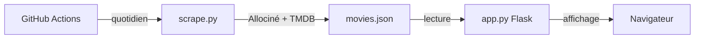

<div align="center">

# CinéLyon
<i>Découvrez la scène cinématographique de Lyon instantanément et sans effort</i>

<p align="center">
  <a href="https://www.python.org/">
    
  </a>
  <a href="https://flask.palletsprojects.com/">
    
  </a>
  <a href="https://github.com/features/actions">
    
  </a>
  <a href="https://www.themoviedb.org/">
    
  </a>
  <a href="https://www.mapbox.com/">
    
  </a>
  <a href="https://www.allocine.fr/">
    
  </a>
</p>
</div>

## Crédit

Ce projet est un fork de [grainParisArt-Public](https://github.com/solene-drnx/grainParisArt-Public).

### Liste des 7 cinémas choisis

- Pathé Carré de Soie
- Pathé Bellecour
- UGC Part-Dieu
- UGC Confluence
- UGC Internationale
- Ciné Meyzieu
- Ciné Toboggan

## Fonctionnalités

- **Calendrier interactif** : Visualisez les horaires sur 7 jours
- **Informations détaillées** : Synopsis, réalisateur, genres, durée, notes
- **Carte interactive** : Localisation de tous les cinémas de Lyon
- **Interface moderne** : Design responsive et élégant
- **Scraping automatique** : Données mises à jour quotidiennement via GitHub Actions
- **Notes et critiques** : Intégration avec TMDB pour les évaluations

## Architecture

```
cinelyon/
├── app.py                 # Application Flask (lecture seule de movies.json)
├── scrape.py              # Script de scraping (exécuté par GitHub Actions)
├── movies.json            # Données des films (généré automatiquement)
├── requirements.txt       # Dépendances Python
├── .env.sample            # Template des variables d'environnement
├── .github/
│   └── workflows/
│       └── scrape.yml     # Workflow GitHub Actions (scraping quotidien)
├── modules/
│   └── Classes.py         # Classes métier (Movie, Theater, Showtime)
├── templates/
│   ├── base.html          # Template de base
│   └── index.html         # Page principale
└── static/
    ├── css/
    │   └── main.css       # Styles CSS
    ├── font/              # Polices personnalisées
    └── images/            # Images et icônes
```

### Flux de données



## Installation

### Prérequis

- Python 3.10+
- Un compte GitHub (pour le scraping automatique)

### Configuration locale

1. **Cloner le repository**
   ```bash
   git clone https://github.com/votre-username/cinelyon.git
   cd cinelyon
   ```

2. **Installer les dépendances**
   ```bash
   pip install -r requirements.txt
   ```

3. **Configurer les variables d'environnement**

   Créez un fichier `.env` basé sur `.env.sample` :
   ```env
   TMDB_API_KEY=votre_clé_tmdb_ici
   MAPBOX_TOKEN=votre_clé_mapbox_ici
   THEATERS=[{"id":"P0017","name":"Pathé Bellecour","latitude":45.7578,"longitude":4.8320}]
   ```

4. **Générer les données** (première fois)
   ```bash
   python scrape.py
   ```

5. **Lancer l'application**
   ```bash
   python app.py
   ```

   L'application sera accessible sur `http://localhost:5000`

### Configuration GitHub Actions

Pour activer le scraping automatique quotidien :

1. **Push le projet sur GitHub**

2. **Configurer les secrets** (Settings → Secrets → Actions) :
   - `TMDB_API_KEY` : Clé API TMDB
   - `THEATERS` : Configuration JSON des cinémas

3. **Le workflow s'exécute** :
   - Automatiquement chaque jour à 6h00 UTC
   - Manuellement via Actions → "Scrape Movies" → "Run workflow"

## Obtenir les clés API

- **TMDB** : [themoviedb.org/settings/api](https://www.themoviedb.org/settings/api)
- **Mapbox** : [console.mapbox.com](https://console.mapbox.com/account/access-tokens/)

## Ajouter de nouveaux cinémas

Modifiez la variable `THEATERS` dans votre `.env` :

```json
[
  {"id":"P8507","name":"Pathé Carré de Soie","latitude":45.7641958,"longitude":4.9212527},
  {"id":"NOUVEAU_ID","name":"Nouveau Cinéma","latitude":XX.XXXXX,"longitude":X.XXXXX}
]
```

**Trouver l'ID d'un cinéma :**
- URL : `https://www.allocine.fr/seance/salle_gen_csalle=P8507.html`
- ID : `P8507`

## Déploiement

### Heroku

```bash
# Procfile
web: gunicorn app:app
```

### Docker

```dockerfile
FROM python:3.10-slim
WORKDIR /app
COPY requirements.txt .
RUN pip install -r requirements.txt
COPY . .
EXPOSE 5000
CMD ["gunicorn", "--bind", "0.0.0.0:5000", "app:app"]
```

## Contribution

Les contributions sont les bienvenues ! N'hésitez pas à ouvrir une Pull Request.

---

**CinéLyon** - Parce que le cinéma lyonnais mérite plus d'attention !
