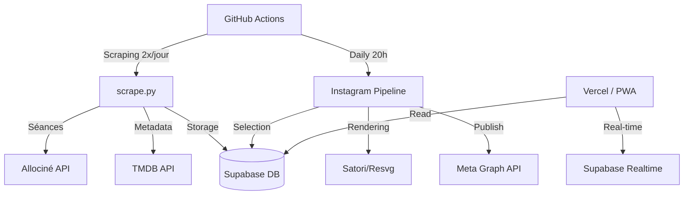

<div align="center">

# CinéLyon
*Découvrez la scène cinématographique de Lyon instantanément et sans effort*

<p align="center">
  <a href="https://www.python.org/">
    
  </a>
  <a href="https://flask.palletsprojects.com/">
    
  </a>
  <a href="https://www.typescriptlang.org/">
    
  </a>
  <a href="https://vercel.com/">
    
  </a>
  <a href="https://github.com/features/actions">
    
  </a>
  <a href="https://supabase.com/">
    
  </a>
</p>
</div>

## Le projet

CinéLyon est une plateforme moderne conçue pour les cinéphiles lyonnais. Elle agrège les séances de 18 cinémas (indépendants et grands circuits) tout en mettant l'accent sur la richesse éditoriale : reprises cultes, films d'auteur et ressorties patrimoniales.

## Fonctionnalités clés

- **Calendrier Étendu** : Visualisez les séances jusqu'à 25 jours à l'avance pour les cinémas majeurs.
- **Données Enrichies** : Fusion intelligente des données Allociné (séances, synopsis FR) et TMDB (affiches haute résolution, bandes-annonces, titres originaux).
- **Disponibilité Streaming** : Affiche directement si un film est disponible sur vos plateformes préférées (Netflix, Disney+, etc.) avec liens directs.
- **Système de Favoris & Social** : Sauvegardez vos films et suivez la sélection de vos amis grâce à la synchronisation en temps réel via Supabase.
- **Recherche Intuitive** : Filtrez instantanément par titre, réalisateur, genre, format (IMAX, 4DX, VO/VF) ou cinéma.
- **PWA First** : Expérience fluide sur mobile, installable comme une application native avec support hors-ligne (Service Worker).
- **Automatisation Instagram** : Publication quotidienne d'un carrousel des meilleures séances via un pipeline intelligent.
- **Curation Patrimoniale** : Base de données de films de référence alimentée par les meilleures listes mondiales (Letterboxd Top 250, SensCritique, BFI, etc.).

---

## Pipeline Instagram (Carousel Daily)

Le dossier `scripts/instagram/` contient un orchestrateur TypeScript qui génère chaque jour un carrousel optimisé pour l'engagement.

### Algorithme de Sélection & Scoring
Le pipeline score les films selon plusieurs critères :
- **Priorité aux Reprises** : Les films classiques et ressorties reçoivent un bonus massif.
- **Prestige Réalisateur** : Bonus automatique pour les films de réalisateurs cultes (Kubrick, Scorsese, Varda, Miyazaki, etc.).
- **Scoring Multi-Source** : Agrégation des notes et classements (Letterboxd, IMDb, Rotten Tomatoes).
- **Diversité Éditoriale** : Limitation intelligente par cinéma pour garantir un carrousel varié.

### Design & Génération Visuelle
- **Moteur Satori & Resvg** : Génération de PNG 1080x1440 à partir de composants React/TSX.
- **Design Adaptatif** :
  - **Slide Couverture** : Scène de film aléatoire récupérée via TMDB.
  - **Calendrier Visuel** : Affichage stylisé de la date du jour.
  - **Slides Films** : Mise en avant du réalisateur et des cinémas indépendants.

---

## Architecture Technique


```mermaid
graph TD
    GA[GitHub Actions] -->|Scraping 2x/jour| S[scrape.py]
    S -->|Séances| AL[Allociné API]
    S -->|Metadata| TM[TMDB API]
    S -->|Storage| SUP[(Supabase DB)]
    
    GA -->|Daily 20h| INST[Instagram Pipeline]
    INST -->|Selection| SUP
    INST -->|Rendering| Satori[Satori/Resvg]
    INST -->|Publish| Meta[Meta Graph API]
    
    V[Vercel / PWA] -->|Read| SUP
    V -->|Real-time| Sync[Supabase Realtime]
```

### Stack Technologique
- **Backend** : Python 3.11+, Flask.
- **Frontend** : Vanilla JS, CSS3, PWA.
- **Automation** : Node.js 18+, TypeScript, GitHub Actions, Playwright.
- **Base de données** : PostgreSQL (via Supabase) avec Row Level Security (RLS).

---

## Installation & Développement

### 1. Prérequis
- **Python 3.11+** et **pip**.
- **Node.js 18+** et **npm**.
- Un compte **Supabase** (gratuit) et un compte **TMDB** (pour la clé API).

### 2. Configuration de la Base de données (Supabase)
Exécutez les scripts SQL suivants dans votre éditeur SQL Supabase pour créer les tables et configurer les politiques de sécurité (RLS) :

```sql
-- Séances quotidiennes
CREATE TABLE showtimes (
  date DATE PRIMARY KEY,
  movies JSONB NOT NULL,
  generated_at TIMESTAMPTZ DEFAULT now()
);

-- Cache métadonnées TMDB
CREATE TABLE tmdb_cache (
  key TEXT PRIMARY KEY,
  data JSONB NOT NULL
);

-- Synchronisation sociale (Favoris)
CREATE TABLE friend_follows (
  id BIGINT GENERATED ALWAYS AS IDENTITY PRIMARY KEY,
  follower_id TEXT NOT NULL,
  followed_id TEXT NOT NULL,
  followed_name TEXT NOT NULL,
  created_at TIMESTAMPTZ DEFAULT now()
);

-- Curation pour Instagram
CREATE TABLE reference_films (
  id BIGINT GENERATED ALWAYS AS IDENTITY PRIMARY KEY,
  title TEXT NOT NULL,
  title_normalized TEXT NOT NULL,
  year INTEGER,
  director TEXT,
  poster_url TEXT,
  sources TEXT[],
  source_count INTEGER DEFAULT 1,
  avg_rank FLOAT,
  avg_note FLOAT DEFAULT 0,
  created_at TIMESTAMPTZ DEFAULT now()
);

-- Suivi des sources de curation
CREATE TABLE reference_sources (
  id TEXT PRIMARY KEY,
  last_scraped_at TIMESTAMPTZ,
  film_count INTEGER
);

-- Sécurité RLS : Lecture publique pour les séances
ALTER TABLE showtimes ENABLE ROW LEVEL SECURITY;
CREATE POLICY "Enable read access for all users" ON showtimes FOR SELECT USING (true);

-- Sécurité RLS : Lecture/Ecriture publique pour le système d'amis
ALTER TABLE friend_follows ENABLE ROW LEVEL SECURITY;
CREATE POLICY "Enable read access for all users" ON friend_follows FOR SELECT TO anon USING (true);
CREATE POLICY "Enable insert for all users" ON friend_follows FOR INSERT TO anon WITH CHECK (true);
CREATE POLICY "Enable delete for all users" ON friend_follows FOR DELETE TO anon USING (true);
```

### 3. Configuration de l'environnement
Copiez le fichier d'exemple et remplissez les variables :
```bash
cp .env.sample .env
```

| Variable | Usage |
|----------|-------|
| `SUPABASE_URL` | URL de votre projet Supabase. |
| `SUPABASE_ANON_KEY` | Clé publique pour l'application web. |
| `SUPABASE_SERVICE_ROLE_KEY` | Clé admin pour le scraping (NE PAS EXPOSER). |
| `TMDB_API_KEY` | Clé API pour les métadonnées et affiches. |
| `THEATERS` | Liste JSON des cinémas (ID Allociné, Nom, Coordonnées). |
| `WEBSITE_TITLE` | Titre de votre instance CinéLyon. |
| `IMGBB_API_KEY` | (Optionnel) Pour l'automatisation Instagram. |
| `INSTAGRAM_ACCOUNT_ID` | (Optionnel) Pour l'automatisation Instagram. |
| `INSTAGRAM_ACCESS_TOKEN` | (Optionnel) Pour l'automatisation Instagram. |

### 4. Installation du Backend (Python)
```bash
# Création de l'environnement virtuel
python -m venv .venv && source .venv/bin/activate
pip install -r requirements.txt

# Scraping initial (remplit Supabase)
python scrape.py

# Lancement de l'application
python app.py
```
Accès local : `http://localhost:5000`

### 5. Installation du Pipeline Instagram (Node/TS)
```bash
cd scripts/instagram
npm install
npx playwright install chromium # Requis pour le seeding

# Initialisation de la base de curation (Seeding)
# Pour une source spécifique :
npx ts-node 00_seed_database.ts --source=letterboxd_top500
# Ou pour tout importer d'un coup (plusieurs heures) :
bash seed_all.sh

# Tester la génération du carrousel (Dry-Run)
npx ts-node run.ts --dry-run
```

---

## Qualité & Maintenance
```bash
ruff check .   # Linting Python
pytest         # Tests unitaires
```

### GitHub Actions
Le projet inclut deux workflows principaux :
1. `scrape.yml` : Lance le scraping automatique 2 fois par jour.
2. `instagram-daily.yml` : Génère et publie le carrousel quotidien à 20h.

*Note : Assurez-vous de configurer les variables d'environnement dans les secrets GitHub (Actions Secrets).*

---

<div align="center">

**CinéLyon** - Parce que le cinéma lyonnais mérite plus d'attention !

</div>
