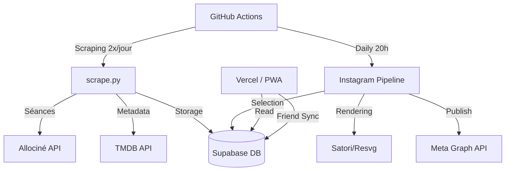

<div align="center">

# CinéLyon
*Découvrez la scène cinématographique de Lyon instantanément et sans effort*

<p align="center">
  <a href="https://www.python.org/">
    
  </a>
  <a href="https://flask.palletsprojects.com/">
    
  </a>
  <a href="https://www.typescriptlang.org/">
    
  </a>
  <a href="https://vercel.com/">
    
  </a>
  <a href="https://github.com/features/actions">
    
  </a>
  <a href="https://supabase.com/">
    
  </a>
</p>
</div>

## Le projet

CinéLyon est une plateforme moderne conçue pour les cinéphiles lyonnais. Elle agrège les séances de 20 cinémas (indépendants et grands circuits) tout en mettant l'accent sur la richesse éditoriale : reprises cultes, films d'auteur et ressorties patrimoniales.

## Fonctionnalités clés

- **Calendrier Étendu & Export** : Visualisez les séances jusqu'à 25 jours à l'avance et ajoutez-les directement à votre calendrier (Apple Calendar / Google Calendar).
- **Données Enrichies & Bandes-Annonces** : Fusion intelligente des données Allociné (séances, synopsis FR) et TMDB (affiches haute résolution, bandes-annonces intégrées, titres originaux).
- **Disponibilité Streaming** : Affiche directement si un film est disponible sur vos plateformes préférées (Netflix, Disney+, etc.) avec liens directs.
- **Système de Favoris & Social Sync** : Sauvegardez vos films et partagez/suivez la sélection de vos amis grâce à un système de synchronisation multiappareil propulsé par Supabase.
- **Recherche & Filtres Avancés** : Filtrez instantanément par titre, réalisateur, genre, format (IMAX, 4DX, VO/VF), horaire, favoris ou cinéma.
- **PWA First** : Expérience fluide sur mobile, installable comme une application native avec support hors-ligne (Service Worker) et gestion de cache optimisée.
- **Automatisation Instagram** : Publication quotidienne d'un carrousel des meilleures séances via un pipeline intelligent.
- **Curation Patrimoniale** : Base de données de films de référence alimentée par les meilleures listes mondiales (Letterboxd, SensCritique, BFI, etc.).

---

## Pipeline Instagram (Carousel Daily)

Le dossier `scripts/instagram/` contient un orchestrateur TypeScript qui génère chaque jour un carrousel optimisé pour l'engagement :
- `00_seed_database.ts` : Initialisation et enrichissement de la base de référence.
- `01_select_films.ts` : Sélection algorithmique des 8 meilleurs films du jour (prenant en compte le prestige, la qualité et la diversité).
- `02_fetch_showtimes.ts` : Récupération des horaires précis pour la sélection.
- `03_generate_images.tsx` : Rendu des slides en PNG via Satori et Resvg.
- `04_generate_caption.ts` : Création de la description Instagram.
- `05_publish_instagram.ts` : Publication automatisée via la Meta Graph API.

---

## Architecture Technique


```mermaid
graph TD
    GA[GitHub Actions] -->|Scraping 2x/jour| S[scrape.py]
    S -->|Séances| AL[Allociné API]
    S -->|Metadata| TM[TMDB API]
    S -->|Storage| SUP[(Supabase DB)]
    
    GA -->|Daily 20h| INST[Instagram Pipeline]
    INST -->|Selection| SUP
    INST -->|Rendering| Satori[Satori/Resvg]
    INST -->|Publish| Meta[Meta Graph API]
    
    V[Vercel / PWA] -->|Read| SUP
    V -->|Friend Sync| SUP
```

### Stack Technologique
- **Backend** : Python 3.11+, Flask (app.py).
- **Frontend** : Vanilla JS, CSS3, PWA (Manifest + Service Worker).
- **Automation** : Node.js 18+, TypeScript, GitHub Actions.
- **Base de données** : PostgreSQL (via Supabase) avec Row Level Security (RLS).

---

## Installation & Développement

### 1. Prérequis
- **Python 3.11+** et **pip**.
- **Node.js 18+** et **npm**.
- Un compte **Supabase** (gratuit) et un compte **TMDB** (pour la clé API).

### 2. Configuration de la Base de données (Supabase)
Exécutez `fix_rls.sql` et les commandes définies pour configurer le schéma, incluant les tables :
- `showtimes` (Séances)
- `tmdb_cache` (Cache)
- `friend_follows` (Synchronisation sociale)
- `reference_films` et `reference_sources` (Curation)

### 3. Configuration de l'environnement
Copiez le fichier d'exemple et remplissez les variables :
```bash
cp .env.sample .env
```

### 4. Installation du Backend (Python)
```bash
python -m venv .venv && source .venv/bin/activate
pip install -r requirements.txt

# Scraping initial (remplit Supabase)
python scrape.py

# Lancement de l'application
python app.py
```
Accès local : `http://localhost:5000`

### 5. Utilisation & Tests du Pipeline Instagram (Node/TS)
```bash
cd scripts/instagram
npm install

# Initialisation de la base de curation (Seeding)
# Pour une source spécifique (ex: Top 500 Letterboxd) :
npx ts-node 00_seed_database.ts --source=letterboxd_top500

# Pour tout importer d'un coup (plusieurs dizaines de minutes) :
bash seed_all.sh

# Vérifier les statistiques de la base de curation :
npx ts-node check_stats.ts

# Tester la génération du carrousel pour demain (Dry-Run, sans publication) :
npx ts-node run.ts --dry-run

# Tester la génération pour un jour précis (ex: 25 mai 2026) :
npx ts-node run.ts --date=2026-05-25 --dry-run

# Lancer la publication réelle pour un jour précis :
npx ts-node run.ts --date=2026-05-25
```

### 6. Déploiement & Gestion du Cache PWA (Important)
L'application fonctionne comme une PWA (Progressive Web App) avec une gestion stricte du cache via un Service Worker. Lors du déploiement de modifications sur les fichiers statiques (CSS, JS) :
1. **Dans `static/sw.js`** : Incrémentez la constante `CACHE_VERSION` (ex. `v12` -> `v13`). Cela signale aux navigateurs qu'un nouveau Service Worker est disponible et déclenchera l'apparition de la bannière de mise à jour chez les utilisateurs.
2. **Incrémentez les paramètres de cache-busting** des fichiers statiques pour forcer l'invalidation du cache natif d'iOS/Safari. Les 4 assets concernés sont répartis dans 3 templates :
   - `templates/base.html` : `main.css?v=X.X` et `settings.js?v=X.X`
   - `templates/index.html` : `index.js?v=X.X`
   - `templates/film.html` : `film.js?v=X.X`
3. **Dans `templates/base.html`** : Mettez à jour le texte affiché dans la modale des paramètres (`<div class="version-info">Version X.X</div>`).

#### Automatisation du Versioning
Pour éviter de faire ces étapes manuellement, vous pouvez utiliser les outils suivants :

##### A. En local (PC)
Exécutez le script Python d'invalidation à la racine du projet :
```bash
python3 scripts/bump_pwa_version.py
```

##### B. Via GitHub Actions
Un workflow manuel `.github/workflows/bump-version.yml` est disponible. Vous pouvez le déclencher :
* **Via l'interface GitHub** : Allez dans l'onglet **Actions** -> Sélectionnez le workflow **Bump PWA Version** -> Cliquez sur **Run workflow**.
* **Via la CLI GitHub (gh)** :
  ```bash
  gh workflow run "Bump PWA Version"
  ```
  *(Le workflow exécutera le script Python, committera les modifications au nom de `github-actions[bot]` et poussera le commit automatiquement).*


---

## Qualité & Maintenance
```bash
ruff check .   # Linting Python
pytest         # Tests unitaires
```

### GitHub Actions
Le projet inclut trois workflows principaux :
1. `scrape.yml` : Lance le scraping automatique quotidiennement à 23h05 UTC (01h05 ou 00h05 heure française).
2. `instagram-daily.yml` : Génère et publie le carrousel quotidien à 07h05 UTC (09h05 ou 08h05 heure française).
3. `bump-version.yml` : Permet d'incrémenter les versions du cache PWA de façon automatisée.

---

## Licence

Ce projet est sous droit d'auteur. Les modifications et ajouts apportés par **abdu-63** sont sa propriété intellectuelle exclusive et ne peuvent être exploités commercialement sans autorisation préalable.

Pour plus de détails, veuillez consulter le fichier [LICENSE.md](LICENSE.md).

---

<div align="center">

**CinéLyon** - Parce que le cinéma lyonnais mérite plus d'attention !

</div>
