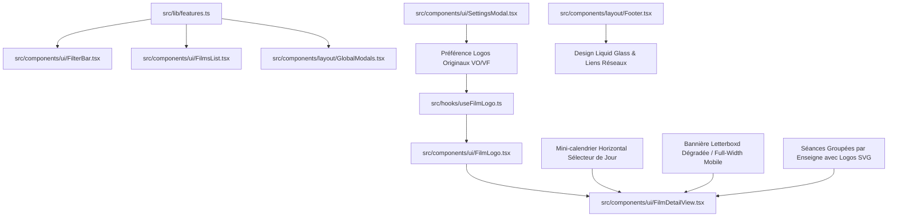

# Plan Technique : Refonte Fiche Film & Feature Flags (Issues #143, #123, #115, #130, #133)

## Architecture & Découpage Technique

---

## Fichiers Cibles

### 1. `src/lib/features.ts` [NOUVEAU]
- Déclaration des Feature Flags :
  - `enableRoulette: false`
  - `enableDoubleFeature: false`
  - `enableCineBot: false`
  - `enableMap: true`
  - `enableRunPee: true`
  - `enablePostCredits: true`
  - `enableSuggestions: true`

### 2. `src/hooks/useFilmLogo.ts` [NOUVEAU] & `src/components/ui/FilmLogo.tsx` [NOUVEAU]
- Port du hook `useFilmLogo` depuis `cinelyon-app` :
  - Recherche TMDB `/search/movie` avec matching par titre, année et nom de fichier d'affiche
  - Récupération des logos transparents via `/movie/{id}/images`
  - Tri et sélection intelligente selon la préférence de langue (`useOriginalTitleLogo`) et notes de votes
  - Cache persistant TanStack React Query (`staleTime: Infinity`)
- Composant `FilmLogo` :
  - Image transparente vectorielle/PNG avec conservation de ratio d'aspect, fondu `opacity` au chargement, et callback `onLogoLoaded`.

### 3. `src/components/ui/FilmDetailView.tsx` [MODIFICATION]
- **Bannière (Issue #123)** :
  - Format immersif mobile pleine largeur (`w-full rounded-none sm:rounded-[24px]`)
  - Format desktop style Letterboxd avec masquage dégradé latéral (`mask-image: linear-gradient(...)` et overlays latéraux) + dégradé bas.
- **Titre Stylisé (Issue #115)** :
  - Intégration de `FilmLogo` au-dessus de la bannière avec fallback élégant sur le titre texte `<h1>`.
- **Mini-calendrier de Séances (Issue #143)** :
  - Remplacement de la liste verticale brute par un défilement horizontal de pilules de dates (`Auj. 31 août`, `Mar 1 sept`, etc.).
  - Pastille rouge d'avant-première.
  - État actif sélectionné par clic.
  - Rendu des séances du jour sélectionné avec `DaySeances` (`groupByBrand={true}`) affichant les logos officiels SVG de cinémas.

### 4. `src/components/ui/SettingsModal.tsx` [MODIFICATION]
- Ajout de l'interrupteur "Préférer les logos originaux (VO)" dans le groupe "Options", synchronisé avec `localStorage` et déclencheur d'événement `cinelyon:settings-changed`.

### 5. `src/components/ui/FilterBar.tsx` & `src/components/ui/FilmsList.tsx` [MODIFICATION]
- Utilisation de `FEATURES.enableRoulette` et `FEATURES.enableDoubleFeature` pour masquer les boutons compagnons superflus et décharger les modales lourdes.

### 6. `src/components/layout/GlobalModals.tsx` [MODIFICATION]
- Conditionner `ChatBot` avec `FEATURES.enableCineBot`.

### 7. `src/components/layout/Footer.tsx` [MODIFICATION]
- Raffinement visuel du footer avec effet Liquid Glass, alignement des espacements et typographies.

---

## Validation & Tests
- Vérification de la compilation TypeScript (`npx tsc --noEmit` et `npm run build`).
- Vérification du bon rendu du calendrier interactif et des logos SVG de cinémas sur la fiche film.
- Vérification de l'absence totale de crash sur WebKit / iOS 15.1.
